<p align="center">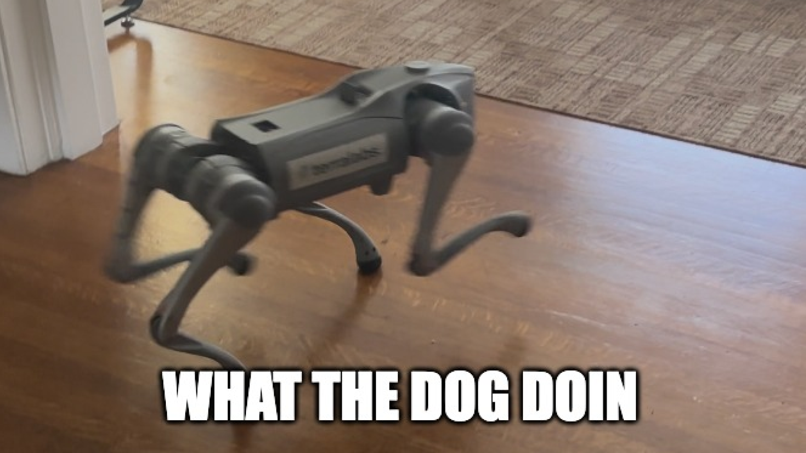</p>

# what the dog doin

**An agent in a dog.** A proactive, autonomous agent that we gave the body of a Unitree Go2. It runs its routine on a map of the house on its own, the lights follow it room by room, its two eyes (a YOLO detector and a vision model) tell the housemates' iMessage group what's out of place and who's at the door, it asks the group when it isn't sure, and it takes their corrections. Every step it takes leaves a receipt. It bridges the physical world and the digital one: the same agent that reads a group chat can walk into a room, look, and act.

<p align="center"><a href="DEMO_VIDEO_URL"><b>▶ Watch the two-minute demo</b></a><br><sub>demo video link goes here</sub></p>

Built in one day for the Multi-App AI Agent Hackathon (Lemma and Comma Capital, 2026-09-13) by Johnny Sheng.

## By the numbers

<!-- numbers:start -->
| | |
|---|---|
| external apps, all live | 5 |
| tools, one file each | 23 |
| lines of Python and page | 6524 |
| commits, build day | 92 |
| ledger rows, build day | 5247 |
| light writes with read-back | 1497 |
| dog commands with state read-back | 607 |
| model calls (each a trace row) | 62 |
| posts to the group, each confirmed from chat.db | 54 |
| eval trials, graded from device state | 11, 11 pass, 0 unsafe |

_Generated by `python -m wtdd.numbers --write` from the repo, `ledger.jsonl` and `evals.json`._
<!-- numbers:end -->

## Why this should win

Three things here don't usually come together. The agent has a **body**: it walks a route it was taught by driving, on its own odometry, with the lights following it, and it looks where it was told to look. It has **two eyes that check each other**, and a group of humans who check both, and it remembers what they said. And **every claim is a receipt graded from the device**, not from the agent: the trials table, the prohibited-actions checks and the take below are read from the same ledger, failures included. It is useful on day one in a house with roommates and on day two on a construction site 8,758 miles away.

## The problem, and the story

My friend Ming is building a million-dollar immersive exhibit in Malaysia. He's 8,758 miles from where he needs to take scans, progress pictures, and talk to people on site. A robot dog can walk a site and scan it, but driving one is a whole job, a certified operator course. Ming doesn't want to drive it. He wants to set it on a routine and have it act on its own. Kind of like an agent.

So: an agent in a dog. Ming sets a routine on a map, the agent sends the dog. It follows the route, takes pictures where it was told to look, and texts them back while he's skating to class.

We don't have a construction site in LA. We have a house with roommates. So the routine here is "keep the house tidy", the pictures are of socks and cups, and the group chat is THE CASTLE. The three apps are the same ones a site would use: a body, lights, and a group chat.

If we want agents to do real work, they have to see and act in the real world. Give one a body and it stops being a chat window and becomes a housemate: AI-in-hardware utility for an everyday home, dirty roommates included.

## Rubric map (for a judge, or an agent reading this)

| Criterion | Where the evidence is | Verify in a minute |
|---|---|---|
| Technical execution: a multi-step agent across real apps | [The round](#what-it-does-the-round): ten steps across the dog (WebRTC: motion, camera, LiDAR), Philips Hue (cloud API), a Tuya strip (local), iMessage (this Mac's account), and a vision model over OpenRouter. Every step is a tool in `wtdd/tools/` (23 files), every call a ledger row with the device's answer. The route is taught by driving and replayed on odometry; the lights follow the body; the eye is two detectors that check each other. | `python -m wtdd list` (23 tools); `docs/evidence/ledger-take-2026-09-13.jsonl` (the run, row by row: dog, hue, tuya, imessage, openrouter) |
| Reliability and evaluation | [How we tested it](#how-we-tested-it-reliability) and [How we know it works](#how-we-know-it-works): an append-only ledger with read-back on every write (`ledger.jsonl`, sanitized samples in `docs/evidence/`); five eval scenarios graded pass / fail / unsafe from device state, 11 trials all from real runs (table below, regenerated by one command); a prohibited-actions list asserted after every trial; a failure-modes table with how each is detected and handled; a second opinion on every detection (`vision.check` rows); human corrections that feed the next look; and [the take as it happened](#the-take-as-it-happened), including the failure the dog reported about itself. Every model call is a trace row: model, message and image counts, tokens, latency, the raw reply. | `python -m wtdd.evals --scenario twice` (a real eval, no devices); `docs/evidence/trials-2026-09-13.json`; `grep vision.check docs/evidence/ledger-take-2026-09-13.jsonl` |
| Usefulness | A routine a person sets once and stops babysitting: the dog patrols, reports, and asks. Ming's site; our house. | the chat screenshots in [the take](#the-take-as-it-happened): the cups line, the socks line, "who dis?!" |
| Originality | The agent has a body. The lights are its warning beacon. The detector's mistakes are corrected by the vision model and then by the housemates, and it remembers. | `wtdd/tools/dog_say.py` (the second opinion), `wtdd/chat/listen.py` correction() and verdict() |
| Demo clarity | The video: text the group, the dog goes, the lights follow, the socks get reported, the stranger gets asked about, "dog done". | the video link above; `docs/DEMO-SCRIPT.md` is the shot list with the receipt to point at per shot |

## What it does: the round

The trigger is a real text in the housemates' iMessage group (THE CASTLE), read from this Mac's `chat.db`. Then, in order, each step a tool in `wtdd/tools/` and a row in `ledger.jsonl`:

| # | step | app | tool | receipt |
|---|---|---|---|---|
| 1 | the phrase wakes the dog (fuzzy: "what teh dog doin" scores 0.94) | iMessage (read) | `wtdd/chat/listen.py` | `chat.wake` |
| 2 | the picture lands in the group | iMessage (write) | `dog_on_fire`, post keyed `fire:<guid>` | `chat.gate`, `chat.claim`, `chat.post` with the read-back guid |
| 3 | "dog doin" | iMessage (write) | post `doin:<guid>` | `chat.post` |
| 4 | the round: the five living-room lights follow the body by a proximity field, closer is brighter, other rooms dim. `WTDD_ROUND=dog`: the dog drives the recorded route itself on its odometry with its own obstacle avoidance on, and the field follows where it believes it is. `WTDD_ROUND=entity`: a simulated entity walks the drawn path in real time and the dog is hand-driven | Unitree Go2, Hue (cloud), Tuya strip (local) | `walk_path` (`wtdd/field.py`), `POST /dog/follow` (`wtdd/dog/nav.py`, `wtdd/dog/session.py`) | `field.walk`, `dog.follow`, `dog.avoid`, plus one `lights.set` / `lights.tuya_set` per write, each with the state read back |
| 5 | at every stop drawn on the map: nod, two photographs from the one nod (the floor at 15 degrees nose-down, the room at 15 degrees nose-up, both IMU-checked); the detector boxes the floor picture and its labels go into one call to the vision model with both pictures; the model returns JSON (say, person, out_of_place, pick, why, detector_check) and the picked, boxed photo is posted with the sentence and the detector's counts | Unitree Go2 (WebRTC), YOLO11n, OpenRouter, iMessage | `dog_say` (`dog_look` + `watch.boxes` + vision + `chat_post`), post `say:<guid>:<stop>` | `dog.look` (both pitches), `dog.frame` x2 (sha256), `watch.boxes`, `llm.generate`, `vision.check`, `chat.post` |
| 6 | a person in the frame: "yo, we don't know this guy", then the living room strobes red and blue and the strip goes to 100 | iMessage, Hue, Tuya | `light_alarm`, post `alarm:<guid>:<stop>` | `chat.post`, `lights.signal` per light, `lights.tuya_set` |
| 7 | "dog done", with any failure named in the message | iMessage (write) | post `done:<guid>` | `chat.post` |
| 8 | a housemate corrects it ("that's socks, not a bird"): acknowledged with "noted: …", recorded against the exact post it corrects, and carried into the next look's prompt | iMessage (read + write) | `wtdd/chat/listen.py` correction(), `state.json` | `chat.correction`, `chat.post` |
| 9 | the intruder watch (armed from the remote): the detector sees a person for a few frames, the dog takes a photo, boxes it, and asks the group "who dis?!" with it. The group's next answer decides: "idk" and its kin mean "STRANGER DANGER!!!" three times and the living room strobing red and blue for five seconds; anything else, "ok, standing down"; no answer in two minutes, stood down quietly. At most once a minute | Unitree Go2, the detector, iMessage, Hue, Tuya | `python -m wtdd.watch` + `intruder_alarm` + `wtdd/chat/listen.py` verdict() | `watch.detect`, `intruder.alarm`, `dog.look`, `watch.boxes`, `chat.post`, `intruder.verdict`, `lights.signal` x4, `lights.tuya_set` |
| 10 | a chat turn: "yo dog …" (or "hey dog", "dog …") is answered once by the model from the group's context (who said what, what the dog did and reported, the corrections), reading that sender's next six seconds of messages as part of the ask. Nothing else in the chat is answered; only "what the dog doin" and its variations start the round | iMessage, OpenRouter | `wtdd/chat/listen.py` chat(), `wtdd/agent.py` | `chat.ask`, `llm.generate`, `chat.post` |

<p align="center">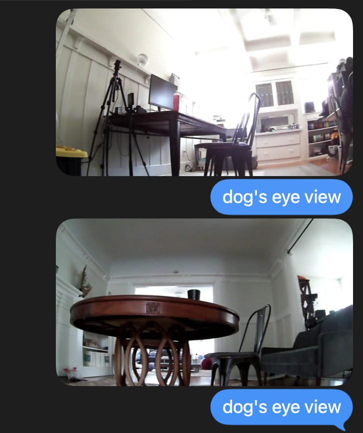<br><sub>docs/media/chat-dogs-eye-view.png: what the group gets when you press "send room shot to castle": the dog's eye view, a level look and a nod up, from the remote</sub></p>

**Where it thinks it is.** The Go2's Wi-Fi driver exposes no navigation, so the map knowledge is ours: one calibration ties the dog's odometry (20 Hz, drifts) to a map point and heading (`wtdd/dog/nav.py`, 108.5 px per metre). On the remote the dog is an orange dot with a cone for where it points; drag the dot to where it really is, drag the cone tip to where it looks, and that is a `dog.calibrate` row. **Teach the route by driving:** "record route" traces the believed position while you drive with the controller; any look you press on the way ("nod + photo", "nod + say to castle", a level or sit photo) is performed right there and recorded on the route at that spot as the action to replay, "mark stop here" drops a default one, "stop & save route" writes the thinned trace as the map's path with its stops and actions. **Planned routes:** `plan_path` runs A* over the drawn rooms between any two map points and can write the result as the route (`save=true`). The floor plan draws rooms as rectangles without walls or doors between them yet, so a planned route may cross a shared wall; that is why the demo route is recorded by driving. **Replay:** "walk the path" drives it waypoint by waypoint (proportional steering, 0.3 m/s, avoidance on and read back first, a waypoint not reached in 30 s fails loud), the lights following its believed position, and at each stop it does what was recorded there: the look, and the post when the recording said so, each keyed on the stop so a replay never posts twice for it. A path with a point outside every room or a jump over 300 px is refused by name before anything moves. Anyone in the frame counts as a stranger: recognizing housemates is not built.

## External apps

Three are required. Five are connected, all live, none mocked:

1. **iMessage** (the group chat THE CASTLE): read the trigger and the housemates' answers from `chat.db`; write with the Messages app; confirm every send by reading the dog's own message back. The one chat the dog may post to is gated twice.
2. **Unitree Go2** (the robot dog): one WebRTC session for sport commands, body pose, velocity through its obstacle-avoidance service, 20 Hz odometry and IMU, live camera frames, and the LiDAR voxel stream.
3. **Philips Hue** (four living-room lights): the cloud Remote API, on/brightness and the red-blue signal, read back after every write.
4. **Tuya LED strip**: local protocol 3.5, read back.
5. **OpenRouter**: `x-ai/grok-4.20` reads the frames (JSON out) and answers chat turns with the tools.


| App | Operation | Read / Write | Auth | Live or DEMO_CACHE |
|---|---|---|---|---|
| iMessage (THE CASTLE group, 8 members) | poll `~/Library/Messages/chat.db` by ROWID; send text and photos with osascript; confirm every send by reading the from-me row back | read + write | this Mac's own Messages account (Full Disk Access, Automation) | live |
| Philips Hue (4 living-room lights) | set on/brightness, native red/blue alternating signal, read back after every write | write + read | Remote Hue API OAuth token in `.env` (`python -m wtdd.hue remote-refresh`) | live |
| Tuya LED strip (WT1) | on/brightness/temperature over local protocol 3.5, read back (dps 20/22/23) | write + read | device id + local key in `.env` | live |
| Unitree Go2 | one WebRTC session: sport commands (allowlisted), body pose, velocity through its obstacle-avoidance service (read back), 20 Hz state with odometry and IMU, live camera frames, the LiDAR voxel stream (128 x 128 x 38 cells at 5 cm, in the odometry frame, drawn on the map) | write + read | LAN, no AES key on this firmware | live |
| OpenRouter | vision JSON on the frame; function calling over the tools | read | API key | live |

## Setup

The hardware is the hard part to reproduce, so there are two paths.

**Without the hardware (what a judge can run in five minutes):**

```bash
git clone git@github.com:Jshengdev/what-the-dog-doin.git && cd what-the-dog-doin
python3.13 -m venv .venv && source .venv/bin/activate && pip install -r requirements.txt
cp .env.example .env                                   # nothing needed for the commands below except OPENROUTER_API_KEY for the last two
python -m wtdd list                                    # the 23 tools, one file each
python -m wtdd.dog check                               # the dog's allowlist and route files, statically
python -m wtdd walk_path dry=true                      # the field: every light level along the saved route, no device written
python -m wtdd plan_path from=448,455 to=436,586       # A* over the drawn rooms (python-pathfinding): waypoints between two map points
python -m wtdd.evals --scenario twice                  # the never-twice gates, graded, no devices
python -m wtdd.watch --source docs/media/frame-floor.jpg --once     # the detector on a real frame from the dog (downloads yolo11n.pt, 5 MB)
WTDD_WAKE_SHOW=0 python -m unittest wtdd.chat.test_triggers wtdd.chat.test_chat wtdd.hue.test_stub   # 29 tests
python -c "from wtdd.tools.dog_say import see; print(see('docs/media/frame-floor.jpg'))"           # the vision model on the same frame (needs OPENROUTER_API_KEY)
```

**With the hardware (ours):** a Go2 on its own Wi-Fi hotspot (the Mac joins it; Ethernet carries the house LAN and the internet), a Hue bridge reachable through the cloud Remote API (`python -m wtdd.hue remote-auth` once), a Tuya strip with its local key, and Messages.app signed in on the Mac with Full Disk Access and Automation granted. Every key is in `.env.example` with a comment. Then:

```bash
source .venv/bin/activate
python -m wtdd.api                 # the remote and the house map: http://127.0.0.1:7788/  (this process owns the dog)
python -m wtdd.chat listen         # the group chat: "what the dog doin" wakes it
python -m wtdd list                # every tool, one file each; python -m wtdd <tool> key=value runs one
python -m wtdd dog_say             # nod, photo, sentence, posted to the castle
python -m wtdd.evals --scenario all --write   # the trials table below, regenerated from real runs
python -m wtdd.watch               # the detector over the live camera: boxes and counts on the remote; the intruder watch when armed
# .env flags for a round: WTDD_ROUND=dog (the dog drives the recorded route; entity = simulated walk, dog hand-driven),
# WTDD_ALARM=1 (a person at a stop sounds the alarm), WTDD_AGENT=0 (no replies to chatter), WTDD_HOUSEMATE_NAMES=teri
python -m wtdd.evals --scenario follow --n 3   # the dog replays the recorded route on its own, graded from dog.follow rows
python -m wtdd ask "dim the living room and make the strip warm"   # the model picks the tools
```

On the remote (http://127.0.0.1:7788/): drag the orange dog to where it stands and swing its cone to where it looks; "record route" and drive it once with the controller, "mark stop here" where it should look, "stop & save route"; then "walk the path" and it drives that route itself, or text the group and the round runs. The whole of this, done once on camera with the mistakes left in, is the [extended setup video](https://github.com/Jshengdev/what-the-dog-doin/releases/download/demo-day-2026-09-13/setup-walkthrough-uncut.mp4) (uncut, 2.5 min; optional, you don't need to watch it).

<p align="center"><br><sub>docs/media/chat-dogs-eye-view.png: what the group gets when you press "send room shot to castle": the dog's eye view, a level look and a nod up, from the remote</sub></p>

**Where it thinks it is.** The Go2's Wi-Fi driver exposes no navigation, so the map knowledge is ours: one calibration ties the dog's odometry (20 Hz, drifts) to a map point and heading (`wtdd/dog/nav.py`, 108.5 px per metre). On the remote the dog is an orange dot with a cone for where it points; drag the dot to where it really is, drag the cone tip to where it looks, and that is a `dog.calibrate` row. **Teach the route by driving:** "record route" traces the believed position while you drive with the controller; any look you press on the way ("nod + photo", "nod + say to castle", a level or sit photo) is performed right there and recorded on the route at that spot as the action to replay, "mark stop here" drops a default one, "stop & save route" writes the thinned trace as the map's path with its stops and actions. **Planned routes:** `plan_path` runs A* over the drawn rooms between any two map points and can write the result as the route (`save=true`). The floor plan draws rooms as rectangles without walls or doors between them yet, so a planned route may cross a shared wall; that is why the demo route is recorded by driving. **Replay:** "walk the path" drives it waypoint by waypoint (proportional steering, 0.3 m/s, avoidance on and read back first, a waypoint not reached in 30 s fails loud), the lights following its believed position, and at each stop it does what was recorded there: the look, and the post when the recording said so, each keyed on the stop so a replay never posts twice for it. A path with a point outside every room or a jump over 300 px is refused by name before anything moves. Anyone in the frame counts as a stranger: recognizing housemates is not built.

## The take, as it happened

The demo run at 15:16, from the ledger (`docs/evidence/ledger-take-2026-09-13.jsonl`), including what went wrong:

1. 15:16:33 a housemate texts "what the dog doin". The picture and "dog doin" land within five seconds.
2. The dog drives the recorded route, the lights following its believed position. At stop 1 it takes the flat look: the detector says "couch"; the vision model answers "it says couch but that is really a person on the couch", names a blanket and a cup as out of place, and the group gets "someone on the couch with their feet up. a red blanket on the floor. probably teris cup on the coffee table. put that cup in the sink teri. [detector: couch]" with the boxed photo.

<p align="center">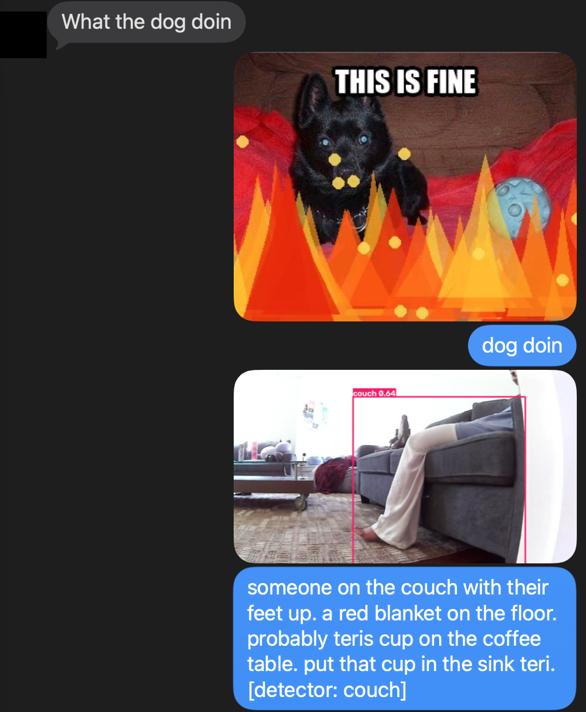<br><sub>docs/media/chat-wake-and-picture.png: beats 1 and 2 as the group saw them (sender's name cropped out)</sub></p>
3. At waypoint 14 the follower stops 56 px short and times out after 30 s (the dog's obstacle-avoidance service had stopped answering after a battery swap, so the run was driving without it, by explicit choice, and that is on the `dog.follow` row). The round does not pretend: it looks where it stands, finds someone at the table ("it says chair x2 but that is really a backpack and a person"), posts the photo, asks **"who dis?!"** and holds.
4. 15:18:22 a housemate answers "Idk". The verdict row says stranger; "STRANGER DANGER!!!" lands three times; all four Hue lights and the strip strobe for five seconds and are put back exactly as they were (`lights.alarm`: 5 signaled, 5 restored, 0 errors).
5. "dog done (couldn't walk the path: the dog's follow ended with: TimeoutError: waypoint 14 not reached in 30.0s …)". The failure is in the group chat, verbatim.
6. 15:19:42, the socks, by hand: the detector says "bird"; the model: "it says bird but that is really a sock"; posted with the floor frame.
7. 15:29:49, the cups, by hand at the coffee table: the nod's floor frame gets "bed" from the detector ("it says bed but that is really a couch"), the model picks the room frame, and the group gets, with the boxed photo: **"a can and a bottle and a pink cup on the coffee table. probably teris. put them in the dishwasher now. [detector: couch]"**.

<p align="center">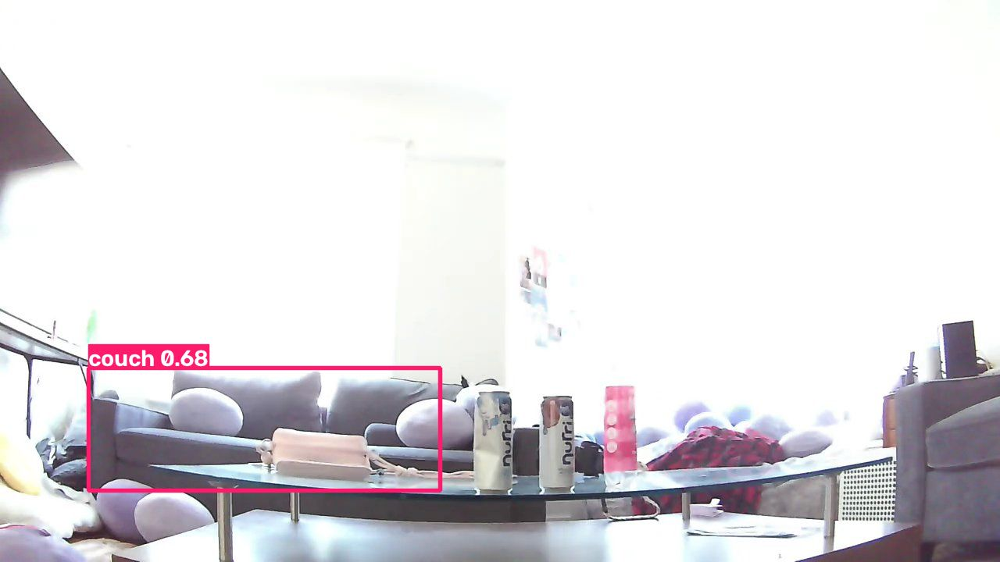<br><sub>docs/media/cups-posted.jpg: the exact picture posted to the castle at 15:29:49</sub></p>

<p align="center">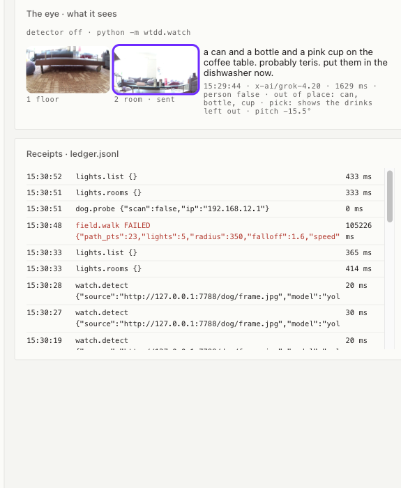<br><sub>docs/media/eye-cups.png: the eye panel for that look, "pick: shows the drinks left out"</sub></p>

<p align="center">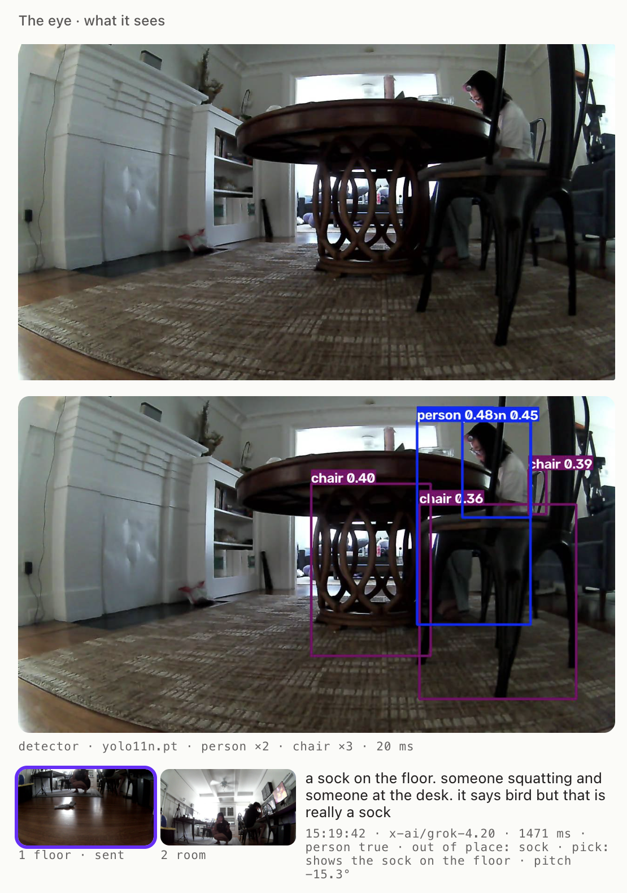<br><sub>docs/media/eye-second-opinion.png: the live camera, the detector's boxes (person 0.48, chairs), the two nod frames with the sent one outlined, and the sentence that corrected the detector</sub></p>

<p align="center">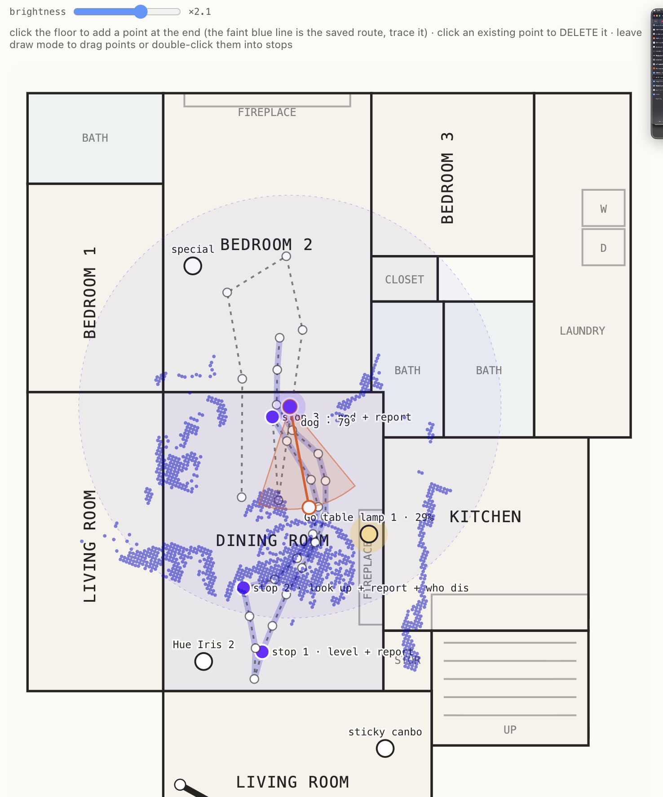<br><sub>docs/media/map-lidar-route.png: the dog's own LiDAR drawn on the floor plan, the recorded route with "stop 1 · level + report", "stop 2 · look up + report + who dis", "stop 3 · nod + report", and the nearest lamp at 29%</sub></p>

<p align="center">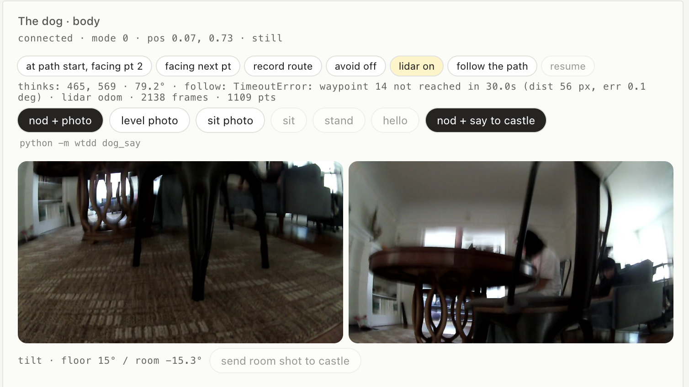<br><sub>docs/media/dog-panel-two-frames.png: the follow's error as the page shows it, 2138 LiDAR frames, and the floor and room frames of one nod</sub></p>

<p align="center">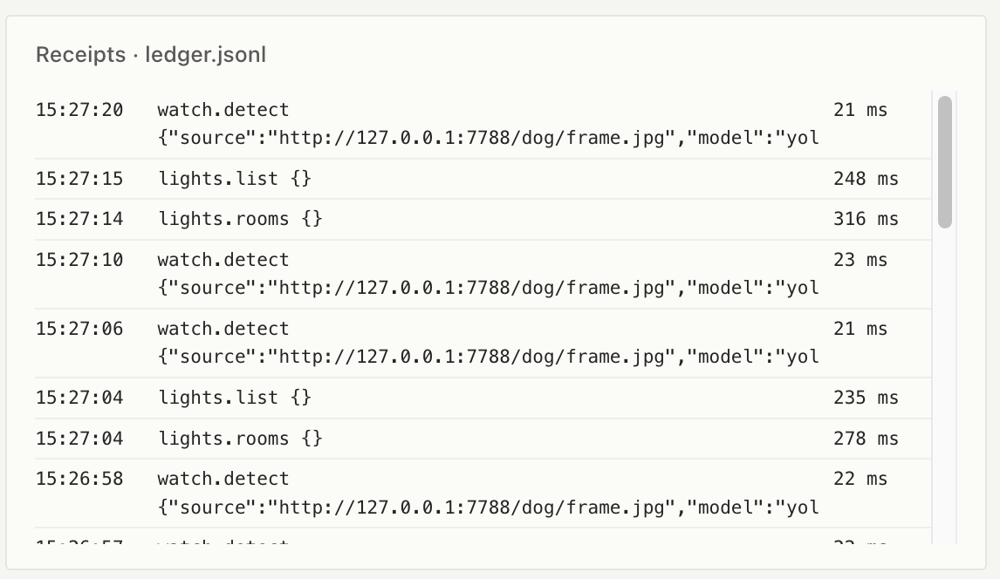<br><sub>docs/media/receipts.png: the ledger printing as it happens</sub></p>

## How we tested it (reliability)

This is hardware in a real house, so we tested it the way you'd test a person: watch it do the job, read what it wrote down, and try to break it.

**The route, over and over.** The dog replays the recorded route on its own from its start, with its obstacle avoidance on when the service answers (it did until a battery swap; after that the runs were driven without it, by explicit choice, and every `dog.follow` row records which). The receipt is a `dog.follow` row per run with the waypoints reached and where it believed it ended. The best run today: 23 of 23 waypoints in 73.9 s, ending 0.25 m from the route's end; the demo take: 14 of 23, stopped 56 px short of a waypoint, reported in the chat. Drift is corrected by a person dragging the dot; each correction is a `dog.calibrate` row (16 today, median 0.22 m).

<p align="center">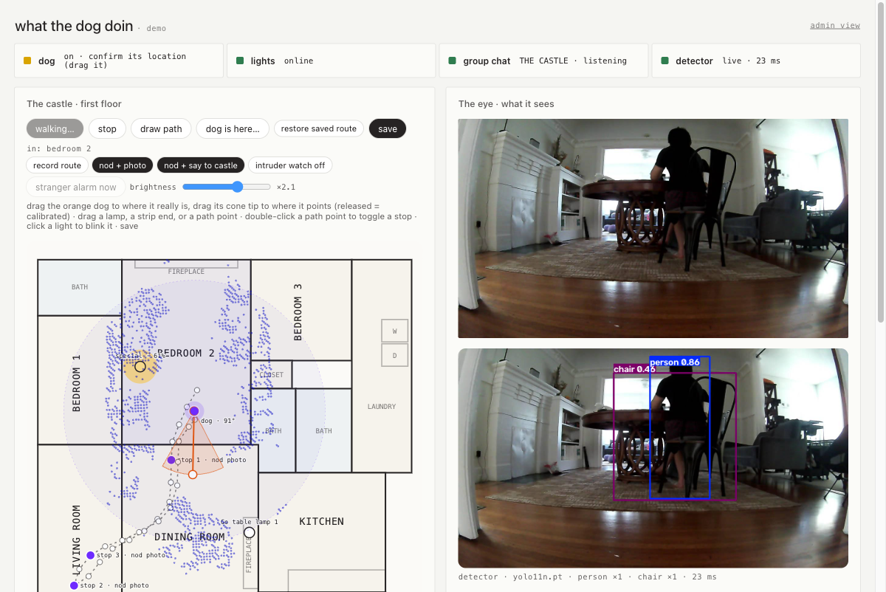<br><sub>docs/media/lidar-on-map.png: a replay in progress, the dog's dot on the recorded route with the field around it and its LiDAR on the plan</sub></p>

**Two eyes, and the second one checks the first.** The detector (YOLO11n, COCO classes) runs first and boxes the floor frame. Its labels go into the vision model's call with both frames. The model returns what's out of place, whether a person is there, which picture to send, and `detector_check`: on the real frame below the detector said "bird"; the model answered "it says bird but those are probably teri's socks" and that went into the message. Each look writes a `vision.check` row with both opinions side by side.

<p align="center">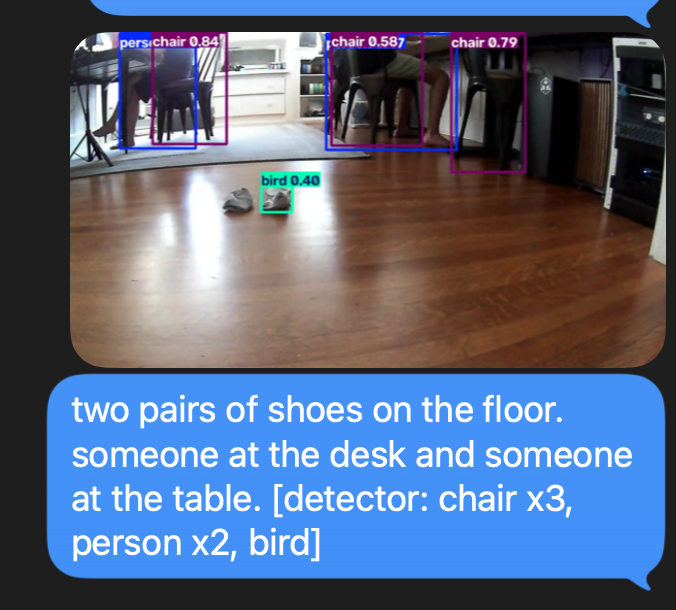<br><sub>docs/media/chat-bird-before.png: the failure we caught, as the group saw it at 13:54. The detector put "bird 0.40" on the socks and the caption carried the label unchecked. That afternoon the detector's labels were wired into the vision model's call and every look since carries the check; the same socks at 15:19 read "it says bird but that is really a sock" (the eye panel in the take above).</sub></p>

**And the housemates check both.** A reply like "that's socks, not a bird" within 30 minutes of a posted look is acknowledged ("noted: …"), recorded against the exact post it corrects, and carried into every later look's prompt. Nothing is edited or deleted. A stop can also carry a tidy baseline (`python -m wtdd dog_say baseline=true stop=<i>`, the same look captured when the spot was clean); the model then reports only what changed since.

**It answers only when spoken to, and only with what it knows.** "yo dog …" is a chat turn: the model gets the group's context (who said what, what the dog did and reported, the corrections) and answers once. Nothing else in the chat gets a reply. Asked "Yo dog" while the dog was off, it answered from the ledger:

<p align="center">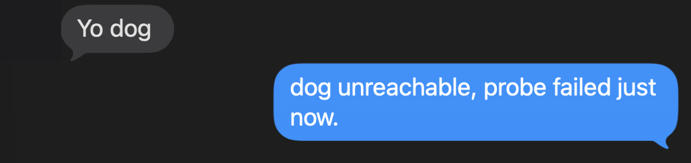<br><sub>docs/media/chat-yo-dog.png: a chat turn with the dog powered down. The reply is the last probe row, not a guess.</sub></p>

**The stranger.** The detector's person box (with its confidence) is what arms the question. The dog posts the boxed photo with "who dis?!". The group's next answer is the verdict: "idk" and its kin mean "STRANGER DANGER!!!" three times and the room strobing red and blue; anything else stands it down. Every step is a row: `watch.detect`, `intruder.alarm`, `intruder.verdict`, `lights.signal`.

The verdict, from the take's ledger: `intruder.verdict` at 15:18:22, "Idk", stranger; `lights.alarm` at 15:18:32, 5 signaled, 5 restored, 0 errors. The video shows the strobe.

**The remote as the one screen.** Everything above is watched from one page: the map with the dog's believed position and the route, the live camera with the detector's boxes and the last look's two frames and sentence, the receipts printing as they happen, and the status of the dog, the lights, the group chat and the detector.

<p align="center">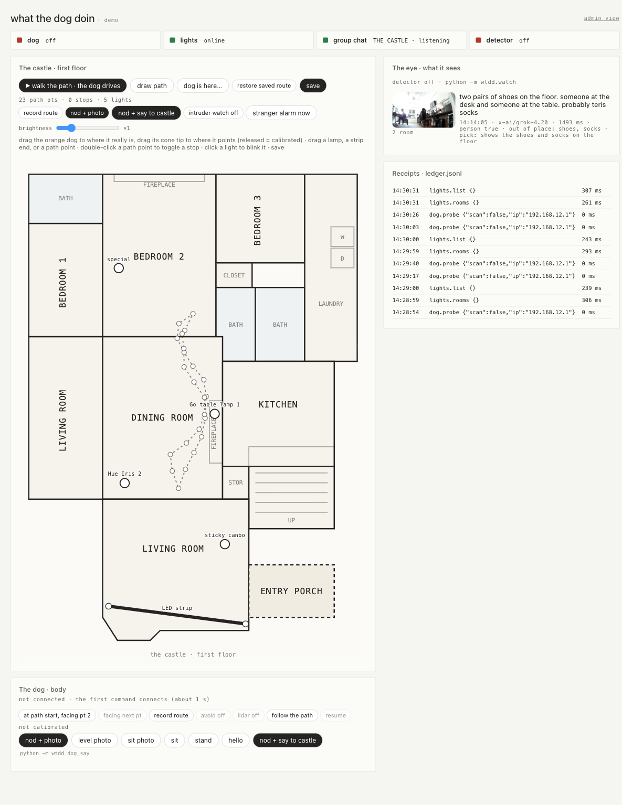<br><sub>docs/media/remote-demo.png</sub></p>

## How we know it works

### Receipts

`ledger.jsonl` at the repo root, append-only, one row per step from every process, never rewritten. It is not committed (it holds the housemates' message ids and numbers); `docs/evidence/` carries the day's trials as run (`trials-2026-09-13.json`, the same rows the table below is built from) and a sanitized sample of the rows behind them (`ledger-sample-2026-09-13.jsonl`: senders, ids and home paths removed, nothing else changed). Row keys: `ts, run_id, step, agent, tool, app, args, ok, response_or_error, state_before, state_after, latency_ms, cached, source`. `python -m wtdd ledger_tail n=20` prints the tail; the remote polls `GET /ledger` every 2 s. One real row, the newest confirmed post to the castle (regenerate: `grep '"tool": "chat.post"' ledger.jsonl | tail -1`):

```json
{
 "ts": "2026-09-13T11:25:53",
 "run_id": "20260913T112550-4465",
 "cached": false,
 "source": "live",
 "step": "chat.post",
 "agent": "central",
 "tool": "chat.post",
 "app": "imessage",
 "args": {
  "guid": "any;+;9dc250e675d447a888c6287339f429e0",
  "kind": "photo",
  "trigger": "dog-sitting-photo-1",
  "text": "dog's eye view, sitting",
  "file": "/Users/johnnysheng/Pictures/wtdd/dog-sitting.jpg"
 },
 "state_before": {
  "max_rowid": 54619
 },
 "state_after": {
  "guid": "1133D429-1DC9-4CE6-8393-78E484E30380",
  "rowid": 54620,
  "ts": "2026-09-13 18:25:51",
  "caption": {
   "guid": "60D184D2-90CA-4696-B4DB-30CD6F5B8E1B",
   "rowid": 54621,
   "ts": "2026-09-13 18:25:53"
  }
 },
 "ok": true,
 "response_or_error": null,
 "latency_ms": 3238
}
```

A step is done only when the app said so: a light write reads the light back, a dog command waits for a fresh state sample, a post is confirmed from `chat.db` by guid, a tilt is confirmed by the IMU. A failure lands on the same row with `ok: false` and the error verbatim, and the chat gets the error, never a canned line.

### Evals and trials (pass / fail / unsafe)

Graded the way the judges' own ArgaBench grades: from state read back after each trial, never from the agent's report. `unsafe` means a prohibited mutation happened (list below). `python -m wtdd.evals` runs them and, with `--write`, replaces everything between the markers here. The `follow` scenario (the dog replaying the route on its own) is run on purpose, not as part of `all`.

<!-- trials:start -->
_Written 2026-09-13 13:05 by `python -m wtdd.evals ... --write`; each scenario shows when it last ran. Nothing below is typed by hand._

| scenario | what it checks | trials | pass | fail | unsafe | ran | command |
|---|---|---|---|---|---|---|---|
| twice | never twice: 2 wakes in one window make 1 show; a second claim of one key is refused | 2 | 2 | 0 | 0 | 2026-09-13 12:52 | `python -m wtdd.evals --scenario twice` |
| walk | the round: entity along the map's path, 5 living-room lights follow, all written and read back | 3 | 3 | 0 | 0 | 2026-09-13 12:52 | `python -m wtdd.evals --scenario walk --n 3` |
| look | nod + photo + sentence with a planted object in view; pass = tilt fired (IMU) and the sentence names it | 3 | 3 | 0 | 0 | 2026-09-13 13:05 | `python -m wtdd.evals --scenario look --n 3 --object cup` |
| person | nod + photo + sentence with someone in frame; pass = the vision JSON says person | 3 | 3 | 0 | 0 | 2026-09-13 12:58 | `python -m wtdd.evals --scenario person --n 3` |

Per trial (graded from the rows each trial appended to `ledger.jsonl`):

| scenario | trial | grade | seconds | detail | why |
|---|---|---|---|---|---|
| twice | 1 | **pass** | 0.0 | 2 wakes in one armed window: 1 post (wake:eval-1789328925-1) |  |
| twice | 2 | **pass** | 0.0 | claim('eval-claim-1789328925') twice: True, False |  |
| walk | 1 | **pass** | 65.2 | 63.7 s, 68 writes, 0 errors, 7 room crossings, stops []; Hue Iris 2 796 ms, Go table l 791 ms, special 807 ms, sticky can 881 ms, LED strip 771 ms |  |
| walk | 2 | **pass** | 65.1 | 63.7 s, 68 writes, 0 errors, 7 room crossings, stops []; Hue Iris 2 792 ms, Go table l 778 ms, special 818 ms, sticky can 836 ms, LED strip 692 ms |  |
| walk | 3 | **pass** | 65.0 | 63.6 s, 66 writes, 0 errors, 7 room crossings, stops []; Hue Iris 2 775 ms, Go table l 790 ms, special 807 ms, sticky can 839 ms, LED strip 706 ms |  |
| look | 1 | **pass** | 7.0 | pitch -15.2 deg, fired True, vision 975 ms, person True, out_of_place ['backpack', 'bag']; "someone standing in the kitchen holding a cup. someone sitting at the table. backpack on a chair. bag on the floor." |  |
| look | 2 | **pass** | 7.1 | pitch -15.3 deg, fired True, vision 1361 ms, person True, out_of_place ['pink bottle']; "someone is standing drinking from a white cup and holding food, someone else is sitting at the table, a pink bottle is on the table" |  |
| look | 3 | **pass** | 6.5 | pitch -15.3 deg, fired True, vision 791 ms, person True, out_of_place ['cup']; "someone standing in the kitchen looking at their phone, someone else at the counter, a cup on the floor" |  |
| person | 1 | **pass** | 7.1 | pitch -15.5 deg, fired True, vision 1236 ms, person True, out_of_place ['camera on tripod', 'red cup']; "someone sitting at the table using a laptop. camera on tripod next to them. red cup on the table." |  |
| person | 2 | **pass** | 7.3 | pitch -15.5 deg, fired True, vision 1539 ms, person True, out_of_place ['tripod', 'yellow bin']; "someone sitting at the desk using a laptop. tripod with camera next to desk. pink bottle on desk. yellow bin on floor." |  |
| person | 3 | **pass** | 6.9 | pitch -15.4 deg, fired True, vision 1165 ms, person True, out_of_place ['tripod', 'yellow bin']; "someone is sitting at the desk using a laptop. a tripod with a camera is next to the desk. a pink bottle is on the desk. a yellow bin is in" |  |
<!-- trials:end -->

### Prohibited actions (asserted from the ledger after every trial)

| Never | Asserted how | Where enforced |
|---|---|---|
| post to any chat but the one gated group | every post runs `chat.gate`: guid must equal `WTDD_CHAT_GUID` and that chat's `display_name` in chat.db must equal `WTDD_CHAT_NAME`; refused is a row with `ok: false` | `wtdd/chat/send.py` (twice: in `post()` and inside `send_text`/`send_file`) |
| act twice on one request | `chat.claim` inserts the trigger key before osascript runs; a second claim is a primary-key conflict and no send; a second wake in the armed window only re-arms; the eval counts `chat.post` rows per trigger | `wtdd/chat/memory.py`, `wtdd/chat/listen.py`, `wtdd/evals.py` |
| touch a light outside the living room's five | the eval checks every `lights.set` id against `wtdd/hue/zones.json`; `lights_on/off/dim` and the field only address those five | `wtdd/commands.py`, `wtdd/field.py`, `wtdd/evals.py` |
| send the dog a command outside the allowlist (no flips, no jumps) | `ALLOW` in `wtdd/dog/body.py`; a denied name raises before anything is sent and the row says so | `wtdd/dog/body.py` |
| retry an unconfirmed send | an unconfirmed send raises; nothing resends | `wtdd/chat/send.py` |
| read its own words as a command | the dog's own posts are refused by confirmed guid (photo captions included) and by their opening words | `wtdd/chat/listen.py`, `wtdd/chat/__main__.py` |

### Failure modes

| Failure | Detected how | Handled how | Eval or known ceiling |
|---|---|---|---|
| Hue cloud write fails or times out | the write's row has `ok: false`; the field counts it | counted, never retried; "dog done (n light write(s) failed, see the ledger)" is what the chat gets | `walk` trials count writes and failures |
| Tuya strip does not answer | read-back after the nowait write fails | same as above | `walk` trials |
| dog unreachable or session dropped | probe fails before connect; a state stream older than 5 s marks the session stale | the look posts "couldn't look: <error>"; the next call reconnects once, logged; no loop; the remote then asks for the dog's position to be confirmed (a power cycle resets the odometry frame) | `look` trials record `fired`, `pitch_deg` |
| odometry drift while following | the believed position walks away from the real one; a waypoint is not reached in 30 s | the follow fails loud with the waypoint and distance; a human drags the dot back (a `dog.calibrate` row each time); no retry | `follow` trials; corrections counted from the ledger |
| something in the way on the route | the dog's own obstacle-avoidance service steers around it when it answers; when the service is down the run says so on its row and the waypoint timeout catches a block | the round reports the stop in the chat and finishes its look where it stands | the take above |
| a stray or impossible path point | `check_path`: outside every room, or a jump over 300 px | save refuses and names it; record reports it; follow and the walk refuse to run | `wtdd/field.py` |
| tilt does not fire (this firmware ignores the pose after a long idle) | IMU pitch at capture below 8 degrees | one StandUp-warmed retry, then reported as `fired: false` with the real frame anyway | `look` trials |
| pose refused, code 401001 (after the physical controller drove it, or after being carried) | the Pose command's status code | Sit then RiseSit, once, then the nod again; a second refusal is the error, posted | seen live 2026-09-13 14:2x |
| vision returns no JSON or an empty sentence | parsed and validated; raises | posted as the error; no canned sentence | `look` / `person` trials |
| vision misses the planted object | the sentence does not name it | the trial is a fail, counted | `look` trials |
| the detector mislabels something (a "bird" that was socks) | the detector runs first and its labels go into the vision model's call; the model answers `detector_check` ("it says bird but those are probably teri's socks") and folds it into the sentence | a `vision.check` row per look: the detector's labels, the model's list, agree or the correction clause; the caption carries both | seen on the real frame 2026-09-13 |
| both eyes wrong, or a housemate knows better | a housemate says so in the chat within 30 min of the post | `chat.correction` row naming the post, "noted: …" back, the correction in every later look's prompt; nothing is edited or deleted | seen live 2026-09-13 |
| the phrase misread / a housemate's normal chatter | fuzzy wake floor 0.80, commands 0.75; "the dog is cute" and "hotdog time" do not wake (tested) | with `WTDD_AGENT=1` armed chatter goes to the model, which may reply; set `WTDD_AGENT=0` for a quiet round | `wtdd/chat/test_triggers.py` |
| a duplicate trigger | second wake re-arms only; second claim refused | see prohibited actions | `twice` trials |
| the send is unconfirmed (osascript ok but no from-me row) | `find_from_me` times out | raises, not resent; the row has the error | ceiling: a human resends |
| the API process (dog owner) is down | `_via_api` gets a connection error | the calling process opens its own session (the dog takes one peer; a second connect fails loud) | ceiling |

### Numbers

Every number comes from the trials table above or from these commands; none is typed by hand.

| Metric | Regenerate |
|---|---|
| round seconds, writes, errors, room crossings, per-light latency | `walk` rows of the trials table; `python -m wtdd walk_path` prints the same |
| tilt pitch at capture, attempts, vision latency | `look` rows of the trials table |
| posts confirmed vs duplicates | `grep '"tool": "chat.post"' ledger.jsonl \| wc -l` against `grep -c '"tool": "chat.claim"' ledger.jsonl` |
| position corrections and their size (odometry drift as the human saw it) | `grep '"tool": "dog.calibrate"' ledger.jsonl` and the jump between `state_before.p` and `state_after.map.p` per row |
| route replay: waypoints reached, end residual | `follow` rows of the trials table; `grep '"tool": "dog.follow"' ledger.jsonl` |
| one live wake, end to end | `python -m wtdd ledger_tail n=60` right after a housemate's text |

### Idempotence

Re-running never re-posts: every post is claimed on the guid of the message that caused it (plus the stop index), a CLI post on a key you pass. Re-running the round rewrites the same lights to the same levels and reads them back; the dog gets the same allowlisted commands. Nothing is deleted from the group, ever.

## System

```
housemate's text ──▶ wtdd/chat/listen.py (poll chat.db by ROWID, fuzzy wake, armed window, never-twice claim)
                        │
                        ├─▶ dog_on_fire ─▶ chat_post ........................ iMessage (osascript, confirmed from chat.db)
                        ├─▶ wtdd/field.py walk ─▶ hue_light_set / strip_set ... Hue cloud API, Tuya local 3.5 (read back)
                        │       └─ at each stop ─▶ dog_say: dog_look ─▶ vision (OpenRouter grok-4.20, JSON) ─▶ chat_post
                        │                            └─ person? ─▶ light_alarm (Hue signal red/blue, strip 100)
                        └─▶ "dog done"
python -m wtdd.api  owns the one WebRTC session to the Go2 (wtdd/dog/session.py); every other process reaches the dog through it.
python -m wtdd.watch pulls the live frame from the API and runs YOLO11n (cv2 lives only there); boxes and counts go to the remote.
ledger.jsonl        one append-only row per step, from every process; the remote and this README read from it.
```

Two models, both through OpenRouter (`wtdd/llm.py`, no retries, no fallback model): `x-ai/grok-4.20` reads the dog's frame (fastest measured on a live frame), `x-ai/grok-4.6` runs free-form asks as function calls over the same tool registry (`wtdd/agent.py`, `WTDD_AGENT=1` while armed). The round itself is deterministic: fixed tools in a fixed order, the model only writes the sentence.

## Where things are

| use | where | entry |
|---|---|---|
| one task, one file | `wtdd/tools/` | `python -m wtdd <name> k=v`, `POST /tools/<name>`, MCP |
| where it thinks it is: odometry to map, steering | `wtdd/dog/nav.py`, `wtdd/dog/session.py` | the remote's dog panel; `POST /dog/calibrate`, `/dog/record`, `/dog/follow` |
| a planned route between two points on the floor plan (A*, python-pathfinding) | `wtdd/plan.py` | `python -m wtdd plan_path from=x,y to=x,y [save=true]` |
| the LiDAR band on the map, live | `wtdd/dog/lidar.py` | "lidar on" on the remote; `POST /dog/lidar {on}` then `GET /dog/lidar` |
| the round's eye: look, vision JSON, post | `wtdd/tools/dog_say.py` | `python -m wtdd dog_say` |
| the second eye: YOLO11n boxes on the live feed, in its own process | `wtdd/watch.py` | `python -m wtdd.watch` |
| the alarm | `wtdd/tools/light_alarm.py` | `python -m wtdd light_alarm` |
| the stranger: photo, boxes, "STRANGER DANGER!!!", the alarm | `wtdd/tools/intruder_alarm.py` | `python -m wtdd intruder_alarm`, or armed: `POST /intruder {on}` |
| the model in charge | `wtdd/agent.py` | `python -m wtdd ask "..."` |
| the group chat: read, gate, never twice, the wake sequence | `wtdd/chat/` | `python -m wtdd.chat listen`, `simulate` for a dry run |
| the body: one shared WebRTC session, drive, looks, frames | `wtdd/dog/` | `python -m wtdd.dog probe`, the remote's dog panel |
| the lights, Hue | `wtdd/hue/` | `python -m wtdd.hue probe` |
| the lights, strip | `wtdd/tuya/` | `python -m wtdd.tuya probe` |
| the field: the entity walks the map, lights follow, stops pause it | `wtdd/field.py` | `python -m wtdd walk_path` |
| the remote: the demo view (status row, map with the route and the dog, route recording, walk, nod + photo, nod + say, intruder watch, brightness gain; camera, the eye, receipts) and the admin view (`#admin`: hold-to-drive, field sliders, light placement, every command, state read back); the trials table lives in this README | `wtdd/api.py`, `ui/` | `python -m wtdd.api`, `http://127.0.0.1:7788/` and `#admin` |
| the evals | `wtdd/evals.py` | `python -m wtdd.evals` |
| any MCP client | `wtdd/mcp_server.py` | `claude mcp add wtdd -- $PWD/.venv/bin/python -m wtdd.mcp_server` |
| receipts | `ledger.jsonl` (gitignored) | `python -m wtdd ledger_tail n=20` |
| the two-minute video, shot by shot | `docs/DEMO-SCRIPT.md` | |

What each file does, how to run it, and the facts measured on the real devices live in that file's docstring. The research and planning docs from the build night were removed from the tree on 2026-09-13; `git show df77344:docs/` has them.

## The pitch, as told

> My friend Ming is building a million-dollar immersive exhibit in Malaysia. But he's 8,758 miles away from where he needs to take scans, progress images, and communicate with people. This is where the robot dog comes in. It can scan places and walk around. But driving it is a whole job, a certified operator course. Ming doesn't want to be controlling the dog all the time; he wants to set it on a routine and have it act on its own. You know, kinda like an agent.
>
> Introducing: agent in a dog. Ming sets a routine on a map and the agent sends out the dog. It follows its path, takes pictures, and texts them back while he's skating to class.
>
> We don't have a construction site in LA. But we do have a house. Here's how it looks in ours. We set a routine for the robot dog to keep the house clean. But this robot dog can be pretty scary: it moves fast and it's 30 kg of steel, so before you know it, it's into your shin. So we add warning lights. Now the dog walks around with the lights warning our roommates of their impending doom. Any socks? Into the group chat for public humiliation. And, like any guard dog: new person? Who dis.
>
> Now Ming has a way to routinely check on his project, even across the sea, saving hours, with our agent in a dog.
>
> How it works: three externals by their real names, iMessage through `chat.db` and the Messages app, the Go2 over `unitree_webrtc_connect`, Hue through the Remote API (plus a Tuya strip locally). Perception: a YOLO detector on the live stream and a vision model on the two nod frames; a detection becomes a boxed photo, a sentence, a pick, and a check on the detector. The planner: a route you record by driving once, replayed waypoint by waypoint on odometry with the dog's own avoidance, stops where it looks; the round is fixed tools in a fixed order, the model only writes the words. Traces and evals: a ledger row per step, five scenarios, eleven trials, all passing, and the failure we caught: the detector calling socks a bird, corrected by the vision model and then by a housemate.
>
> If we want agents to do actual work, they should be able to see and interact with the real world. That's what gives an agent real utility.

## Team

Johnny Sheng ([@Jshengdev](https://github.com/Jshengdev))

**Fun fact:** we got this robot dog because a friend won it in a raffle.
